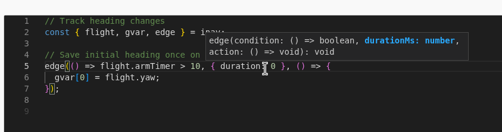
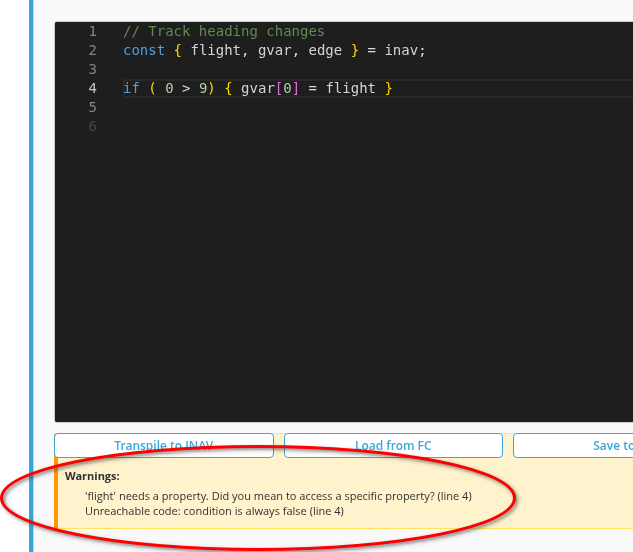
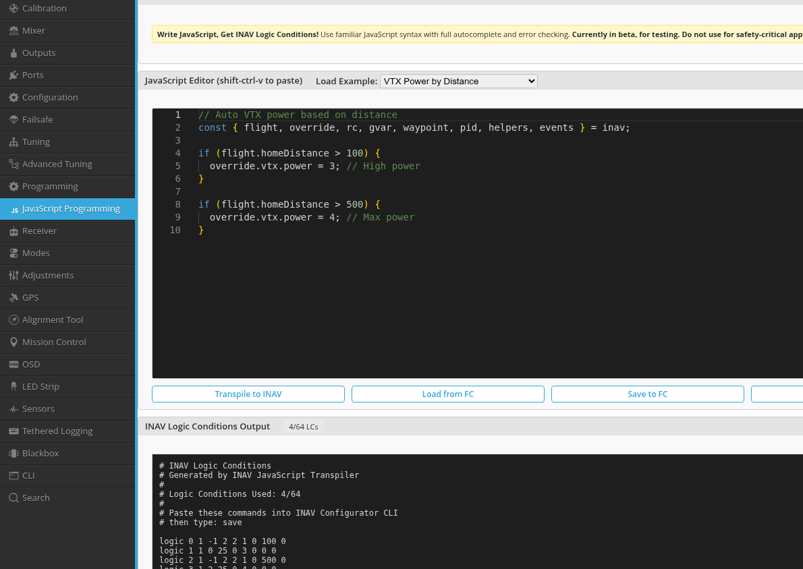
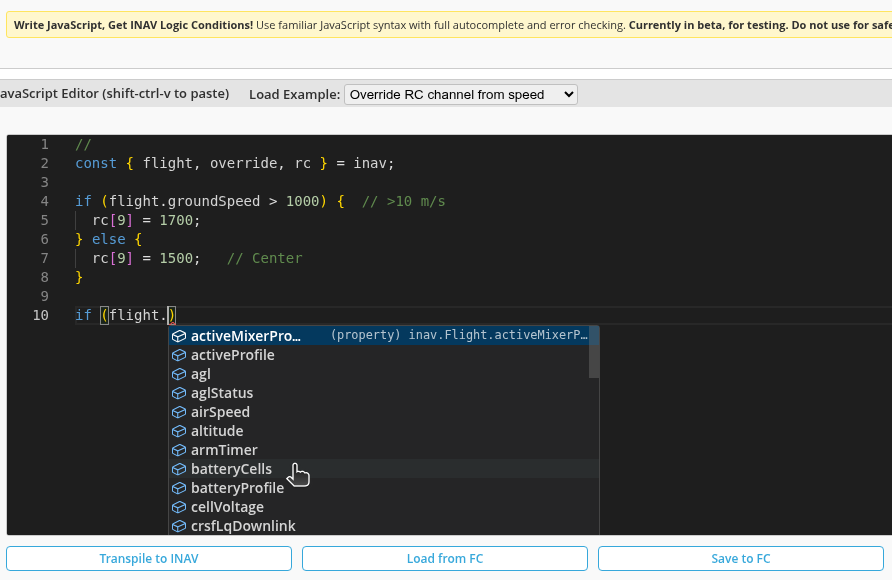

# INAV JavaScript Programming

The INAV Configurator includes a JavaScript transpiler that allows you to program flight controller logic conditions using JavaScript instead of raw logic condition commands. This provides a modern development experience with IntelliSense, syntax highlighting, and real-time validation.

## 📚 Table of Contents

- [Quick Start](#quick-start)
- [Features](#features)
- [Programming Patterns](#programming-patterns)
- [Supported Operations](#supported-operations)
- [Common Questions](#common-questions)
- [Examples](#examples)

---

## Quick Start

The JavaScript transpiler converts JavaScript code into INAV logic conditions, enabling you to program flight controller behavior using familiar JavaScript syntax.

### Modern Development Experience


*Real-time autocomplete with type information and documentation*


*Clear error messages with line numbers and suggestions*

### Basic Example

```javascript
const { flight, override } = inav;

// Increase VTX power when far from home
if (flight.homeDistance > 500) {
  override.vtx.power = 4;
}
```


*Complete example showing VTX power control based on distance*

---

## Features

### Bidirectional Translation

- **Transpiler**: JavaScript → INAV Logic Conditions
- **Decompiler**: INAV Logic Conditions → JavaScript
- **Round-trip capable**: Code survives transpile/decompile cycles

### Development Experience

- **Monaco Editor**: Full-featured code editor with syntax highlighting
- **IntelliSense**: Context-aware autocomplete with documentation
- **Real-time Validation**: Immediate feedback on syntax errors
- **Error Messages**: Clear, actionable messages with line numbers

### Language Support

**All INAV Operations Supported:**
- Arithmetic operations (`+`, `-`, `*`, `/`, `%`)
- Comparison and logical operations (`>`, `<`, `===`, `&&`, `||`, `!`)
- Math functions (`Math.min()`, `Math.max()`, `Math.sin()`, `Math.cos()`, `Math.tan()`, `Math.abs()`)
- Flow control (`edge()`, `sticky()`, `delay()`, `timer()`, `whenChanged()`)
- Variable management (`gvar[0-7]`, `let`, `var`)
- RC channel access and state detection (`rc[n].value`, `rc[n].low`, `rc[n].mid`, `rc[n].high`)
- Flight parameter overrides (`override.vtx.*`, `override.throttle`, etc.)
- Waypoint navigation

**JavaScript Features:**
- `const` destructuring: `const { flight, override } = inav;`
- `let` variables: variables with a lifetime of that loop only
- `var` variables: allocated to global variables for long lifetime
- Arrow functions: `() => condition`
- Object property access: `flight.altitude`, `rc[0].value`

---

## Programming Patterns

### Continuous Conditions (if statements)

Use `if` statements for conditions that check and execute **every cycle**:

```javascript
const { flight, override } = inav;

// Checks every cycle - adjusts VTX power continuously
if (flight.homeDistance > 100) {
  override.vtx.power = 3;
}
```

**Use when:** You want the action to happen continuously while the condition is true.

### One-Time Execution (edge)

Use `edge()` for actions that should execute **only once** when a condition becomes true:

```javascript
const { flight, gvar, edge } = inav;

// Executes ONCE when armTimer reaches 1000ms
edge(() => flight.armTimer > 1000, { duration: 0 }, () => {
  gvar[0] = flight.yaw;  // Save initial heading
  gvar[1] = 0;           // Initialize counter
});
```

**Parameters:**
- **condition**: Function returning boolean
- **duration**: Minimum duration in ms (0 = instant, >0 = debounce)
- **action**: Function to execute once

**Use when:**
- Initializing on arm
- Detecting events (first time RSSI drops)
- Counting discrete occurrences
- Debouncing noisy signals

### Latching Conditions (sticky)

Use `sticky()` for conditions that latch ON and stay ON until reset:

```javascript
const { flight, override, sticky } = inav;

// Latches ON when RSSI < 30, stays ON until RSSI > 70
sticky(
  () => flight.rssi < 30,  // ON condition
  () => flight.rssi > 70,  // OFF condition
  () => {
    override.vtx.power = 4;  // Executes while latched
  }
);
```

**Use when:**
- Warning states that need manual reset
- Hysteresis/deadband behavior
- Failsafe conditions

### Delayed Execution (delay)

Use `delay()` to execute after a condition has been true for a duration:

```javascript
const { flight, gvar, delay } = inav;

// Executes only if RSSI < 30 for 2 seconds continuously
delay(() => flight.rssi < 30, { duration: 2000 }, () => {
  gvar[0] = 1;  // Set failsafe flag
});
```

**Use when:**
- Avoiding false triggers
- Requiring sustained conditions
- Timeouts and delays

### Periodic Timer (timer)

Use `timer()` for actions that toggle ON and OFF periodically:

```javascript
const { gvar, timer } = inav;

// Toggle gvar[0] every second: ON for 1000ms, OFF for 1000ms
timer(1000, 1000, () => {
  gvar[0] = 1;  // Active during ON phase
});
```

**Use when:**
- Blinking indicators
- Periodic sampling
- Timed sequences

### Change Detection (whenChanged)

Use `whenChanged()` to detect when a value changes by a threshold:

```javascript
const { flight, gvar, whenChanged } = inav;

// Trigger when altitude changes by >= 10m within 100ms
whenChanged(flight.altitude, 10, () => {
  gvar[0] = gvar[0] + 1;  // Count altitude changes
});
```

**Use when:**
- Detecting significant value changes
- Monitoring sensor variations
- Change-based triggers

---

## Supported Operations

### Arithmetic
- `+`, `-`, `*`, `/`, `%` (modulus)

### Comparisons
- `===`, `>`, `<` (standard comparisons)
- `approxEqual(a, b, tolerance)` - approximate equality with tolerance

### Logical
- `&&`, `||`, `!` (standard logical operators)
- `xor(a, b)` - exclusive OR
- `nand(a, b)` - NOT AND
- `nor(a, b)` - NOT OR

### Math Functions
- `Math.min(a, b)` - minimum of two values
- `Math.max(a, b)` - maximum of two values
- `Math.sin(degrees)` - sine (takes degrees, not radians)
- `Math.cos(degrees)` - cosine (takes degrees)
- `Math.tan(degrees)` - tangent (takes degrees)
- `Math.abs(x)` - absolute value

### Scaling Functions
- `mapInput(value, maxValue)` - scales from [0:maxValue] to [0:1000]
- `mapOutput(value, maxValue)` - scales from [0:1000] to [0:maxValue]

Example:
```javascript
// Scale RC throttle (1000-2000) to normalized (0-1000)
const normalized = mapInput(rc[3].value - 1000, 1000);

// Scale normalized (0-1000) to servo angle (0-180)
const servoAngle = mapOutput(normalized, 180);
```

### RC Channel Access

```javascript
// RC channel value (1000-2000us)
if (rc[0].value > 1500) {
  gvar[0] = 1;
}

// RC channel state detection
if (rc[0].low) {      // < 1333us
  gvar[1] = 1;
}
if (rc[1].mid) {      // 1333-1666us
  gvar[2] = 1;
}
if (rc[2].high) {     // > 1666us
  gvar[3] = 1;
}
```

### Variables

```javascript
// Global variables (persisted, 8 slots)
gvar[0] = 100;
gvar[1] = gvar[1] + 1;

// Let variables (compile-time constants)
let maxAlt = 500;
if (flight.altitude > maxAlt) {
  gvar[0] = 1;
}

// Var variables (allocated to gvar slots)
var counter = 0;
counter = counter + 1;
```

Note that variable *names* are stored in Configurator. Loading from the FC to a different computer will use default variable names.
It is recommended to save your scripts in Notepad or your favorite editor when upgrading to a new version of INAV.

### Flight Parameter Overrides

```javascript
const { override } = inav;

// VTX control
override.vtx.power = 4;      // Power level (0-4)
override.vtx.band = 5;       // Band (0-5)
override.vtx.channel = 7;    // Channel (0-8)

// Throttle control
override.throttle = 1500;         // Direct throttle (1000-2000)
override.throttleScale = 75;      // Scale percentage (0-100)

// Arming safety
override.armSafety = 1;           // Override arming checks
```

---

## Common Questions

**Q: Which pattern should I use?**
- Use `if` for continuous control (checking every cycle)
- Use `edge()` for one-time actions when condition becomes true
- Use `sticky()` for latching conditions with hysteresis
- Use `delay()` for actions that need sustained conditions
- Use `timer()` for periodic toggling
- Use `whenChanged()` for detecting value changes

**Q: How do I debug my code?**

Use global variables to track state:
```javascript
const { flight, gvar, edge } = inav;

// Initialize debug counter
edge(() => flight.armTimer > 1000, { duration: 0 }, () => {
  gvar[7] = 0; // Use gvar[7] as debug counter
});

// Increment on each event
edge(() => flight.rssi < 30, { duration: 0 }, () => {
  gvar[7] = gvar[7] + 1;
});

// Check gvar[7] value in OSD or Configurator
```

**Q: What's the difference between let and var?**
- `let` the variable goes away after each loop (implemented via compile-time expression substitution)
- `var` variables are allocated to gvar slots (keep their values between loops)

**Q: How many global variables can I use?**

INAV has 8 global variables: `gvar[0]` through `gvar[7]`. Each can store values from -1,000,000 to 1,000,000.

**Q: Can I use regular JavaScript functions?**

specific INAV functions are supported (`edge()`, `sticky()`, `delay()`, `timer()`, `whenChanged()`, and Math functions). The transpiler converts JavaScript to INAV logic conditions, which have specific supported operations.

---

## Examples

### Initialize Variables on Arm

```javascript
const { flight, gvar, edge } = inav;

edge(() => flight.armTimer > 1000, { duration: 0 }, () => {
  gvar[0] = 0;              // Reset counter
  gvar[1] = flight.yaw;     // Save heading
  gvar[2] = flight.altitude; // Save starting altitude
});
```

### Count Events

```javascript
const { flight, gvar, edge } = inav;

// Initialize counter on arm
edge(() => flight.armTimer > 1000, { duration: 0 }, () => {
  gvar[0] = 0;
});

// Count each time RSSI drops below 30
edge(() => flight.rssi < 30, { duration: 100 }, () => {
  gvar[0] = gvar[0] + 1;
});
```

### VTX Power Based on Distance



```javascript
const { flight, override } = inav;

// Far away - maximum power
if (flight.homeDistance > 500) {
  override.vtx.power = 4;
}

// Medium distance
if (flight.homeDistance > 200 && flight.homeDistance <= 500) {
  override.vtx.power = 3;
}

// Close to home - reduce power
if (flight.homeDistance <= 200) {
  override.vtx.power = 2;
}
```

### Low Voltage Warning with Hysteresis

```javascript
const { flight, gvar, sticky } = inav;

// Latch warning at 3.3V/cell, clear at 3.5V/cell
sticky(
  () => flight.cellVoltage < 330,  // Warning threshold
  () => flight.cellVoltage > 350,  // Recovery threshold
  () => {
    override.throttleScale = 50;   // Reduce throttle
    gvar[0] = 1;                   // Warning flag
  }
);
```

### Debounce Noisy Signal

```javascript
const { flight, override, edge } = inav;

// Only trigger if RSSI < 30 for at least 500ms
edge(() => flight.rssi < 30, { duration: 500 }, () => {
  override.vtx.power = 4;
});
```

### Stick Combination Detection

```javascript
const { rc, gvar } = inav;

// Detect specific stick position combination
if (rc[0].low && rc[1].mid && rc[2].high) {
  gvar[0] = 1;  // Special mode activated
}
```

---

## Available Objects

```javascript
const {
  flight,      // Flight telemetry (altitude, speed, GPS, battery, etc.)
  override,    // Override flight parameters (VTX, throttle, arming)
  rc,          // RC channels (rc[0-17].value, .low, .mid, .high)
  gvar,        // Global variables (gvar[0-7])
  waypoint,    // Waypoint navigation info
  edge,        // Edge detection function
  sticky,      // Latching condition function
  delay,       // Delayed execution function
  timer,       // Periodic timer function
  whenChanged  // Change detection function
} = inav;
```

---

## Tips

1. **Initialize variables on arm** using `edge()` with `flight.armTimer > 1000`
2. **Use gvars for state** - they persist between logic condition evaluations
3. **edge() duration = 0** means instant trigger on condition becoming true
4. **edge() duration > 0** adds debounce time
5. **if statements are continuous** - they execute every cycle
6. **sticky() provides hysteresis** - prevents rapid ON/OFF switching
7. **All trig functions take degrees**, not radians
8. **RC channels**: 0-17 (18 channels total)
9. **Global variables**: -1,000,000 to 1,000,000 range

---

## Version History

**INAV 8.0**: Complete JavaScript programming implementation
- All INAV logic condition operations supported
- RC channel state detection (LOW/MID/HIGH)
- XOR/NAND/NOR logical operations
- Approximate equality with tolerance
- MAP_INPUT/MAP_OUTPUT scaling functions
- Timer and change detection functions
- IntelliSense and real-time validation

---

**Related Pages:**
- [Programming Tab](Programming-tab.md) - How to use the Programming tab
- [Logic Conditions](Logic-Conditions.md) - Traditional logic condition programming

**Last Updated**: 2025-11-25