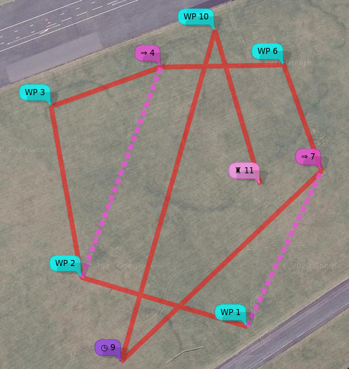
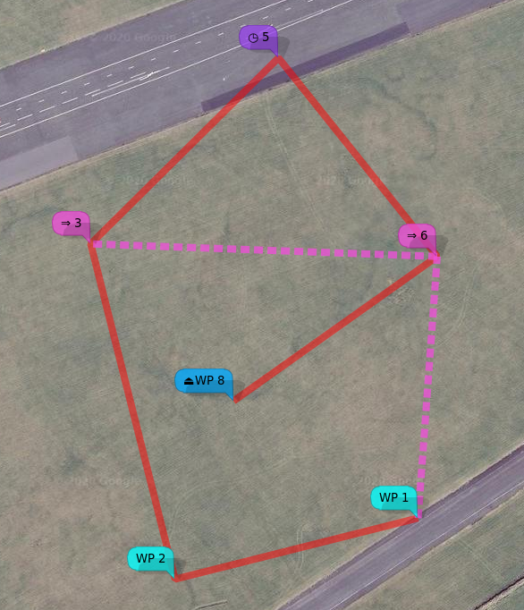
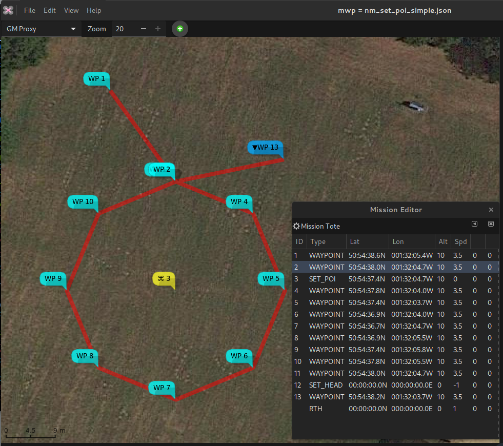
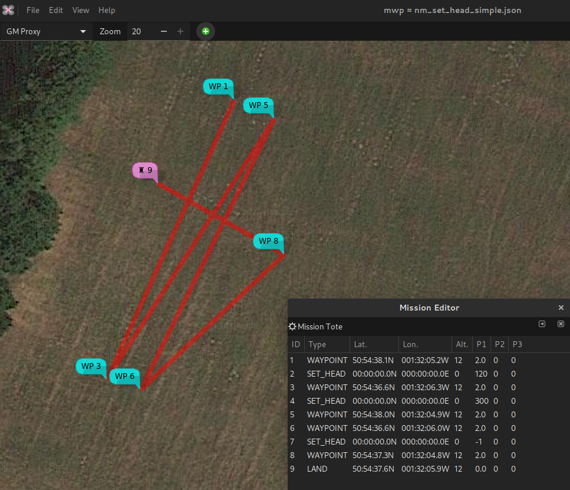

# MSP NAV Protocol and Types

This document describes MSP navigation messages, their usage and implementation details. Both **inav** and **multiwii** implementations (which are largely the same) are documented in this article.

Note that all binary values are little endian (MSP standard).

# Implementation and versions

This document should match the inav 1.2 (and later) and Multiwii 2.5 flight controller firmware. The messages described are implemented in [mwp](https://github.com/stronnag/mwptools) (Linux / FreeBSD / Windows (Cygwin,WSL)), ezgui (Android) mission planners / ground station applications and "drone helper" (Windows 10) mission planner. mwp and ezgui support both iNav and Multiwii; WinGui is a legacy Windows / Multiwii only mission planner that also supports this message set. Prior to inav 3.0, the [inav-configurator](https://github.com/iNavFlight/inav-configurator) supported a subset of  MSP Waypoint (WP) types; for inav 3.0 it is intended to support all WP types.

# WayPoint and Action Attributes

Each  waypoint has a type and takes a number of parameters, as below. These are used in the MSP_WP message. The final column indicated if the message is implemented for inav 1.2 (and later).

| Value | Enum | P1 | P2 | P3 | Lat | Lon | Alt | iNav |
| ---- | ---- | ---- | ---- | ---- | ---- | ---- | ---- | ---- |
| 1 | WAYPOINT      | Speed (cm/s) [1] (exception [6]) | | Altitude Mode [7] | ✔ | ✔ | ✔ | ✔ |
| 2 | POSHOLD_UNLIM |          | | | ✔ | ✔ | ✔ | [5] |
| 3 | POSHOLD_TIME  | Wait time (seconds) | (speed (cm/s)[1]) | Altitude Mode [7] | ✔ | ✔ | ✔ | ✔ 2.5 and later |
| 4 | RTH [4]       | Land if non-zero | | |    |    | ✔ [2] | ✔ |
| 5 | SET_POI [3]   |          | | | ✔ | ✔ | | ✔ 2.6 and later |
| 6 | JUMP          | Target WP#      | No. of repeats (-1 = forever) | | | | | ✔ 2.5 and later |
| 7 | SET_HEAD [3]  | Heading  (degrees) | | | | | | ✔ 2.6 and later |
| 8 | LAND | Speed (cm/s) [1] | Elevation Adjustment (m) [8] | Altitude Mode [7] | ✔ | ✔ | ✔ | ✔ 2.5 and later |

1. Leg speed is an inav extension (for multi-rotors only). It is the speed on the leg terminated by the WP (so the speed for WP2 is used for the leg WP1 -> WP2) (cm/s).
2. Not used by inav
3. Once SET_HEAD or SET_POI is invoked, it remains active until cleared by SET_HEAD with a P1 value of -1.
4. If a mission contains multiple RTH stanzas, then for MultiWii, the mission terminates at the first RTH. For inav, prior to c. 2.6, the mission would continue if RTH-LAND is not set, and valid waypoints follow.
5. If the final entry in a mission is a WAYPOINT, the inav treats it as POSHOLD_UNLIM.
6. For inav's "follow-me" mode (WP#255, POSHOLD engaged), P1 may be used to send an orientation heading (0-359 degrees).
7. inav 3.0 and later, P3 defines the altitude mode. 0 (default, legacy) = Relative to Home, 1 = Absolute (AMSL). Ignored for releases prior to 3.0.
8. inav 3.0 and later, P2 defines the ground elevation (in metres) for the LAND WP. If the altitude mode is absolute, this is also absolute; for relative altitude, then it is the difference between the assumed home location and the LAND WP. Ignored for releases prior to 3.0.

## Geospatial Units 

| Field | XML Mission File | MSP_WP binary message |
| ----- | ---------------- | --------------------- |
| Latitude, Longitude | Decimal degrees, WGS84 | Integer, WGS84 Degrees * 1E7 |
| Altitude | Integer Metres | Centimetres |

## Annotated Example
The following example, using the MW XML (ezgui, inav configurator, mwp) format, illustrates the WAYPOINT, JUMP, POSHOLD_TIME and LAND types:

```
<?xml version="1.0" encoding="utf-8"?>
<mission>
  <missionitem no="1" action="WAYPOINT" lat="54.353319318038153" lon="-4.5179273723848077" alt="35" parameter1="0" parameter2="0" parameter3="0"></missionitem>
  <missionitem no="2" action="WAYPOINT" lat="54.353572350395972" lon="-4.5193913118652516" alt="35" parameter1="0" parameter2="0" parameter3="0"></missionitem>
  <missionitem no="3" action="WAYPOINT" lat="54.354454163955907" lon="-4.5196617811150759" alt="50" parameter1="0" parameter2="0" parameter3="0"></missionitem>
  <missionitem no="4" action="WAYPOINT" lat="54.354657830207479" lon="-4.5186895986330455" alt="50" parameter1="0" parameter2="0" parameter3="0"></missionitem>
  <missionitem no="5" action="JUMP" lat="0" lon="0" alt="0" parameter1="2" parameter2="2" parameter3="0"></missionitem>
  <missionitem no="6" action="WAYPOINT" lat="54.354668848061756" lon="-4.5176009696657218" alt="35" parameter1="0" parameter2="0" parameter3="0"></missionitem>
  <missionitem no="7" action="WAYPOINT" lat="54.354122567317191" lon="-4.5172673708680122" alt="35" parameter1="0" parameter2="0" parameter3="0"></missionitem>
  <missionitem no="8" action="JUMP" lat="0" lon="0" alt="0" parameter1="1" parameter2="1" parameter3="0"></missionitem>
  <missionitem no="9" action="POSHOLD_TIME" lat="54.353138333126651" lon="-4.5190405596657968" alt="35" parameter1="45" parameter2="0" parameter3="0"></missionitem>
  <missionitem no="10" action="WAYPOINT" lat="54.354847022143616" lon="-4.518210497615712" alt="35" parameter1="0" parameter2="0" parameter3="0"></missionitem>
  <missionitem no="11" action="LAND" lat="54.354052100964488" lon="-4.5178091504726012" alt="60" parameter1="0" parameter2="0" parameter3="0"></missionitem>
</mission>
```
Mission points 5 and 8 are JUMP; they have no location as they affect the current location (the previous WP) and cause an action.
* After WP 4 (JUMP at 5), the vehicle will proceed to WP 2 (`parameter1 = 2`); it will do this twice (`parameter2 = 2`). Then it will proceed to WP 6.
* After WP 7 (JUMP at 8), the vehicle will proceed to WP 1 (`parameter1 = 1`); it will do this once (`parameter2 = 1`). Then it will proceed to WP 9.
* The second JUMP (8) will cause the first jump (5) to be re-executed.

Mission point 9 is POSHOLD_TIME. The vehicle will loiter for 45 seconds (`parameter1 = 45`) at the WP9 location. A multi-rotor will hold a steady position, fixed wing will fly in a circle as defined by the CLI parameter `nav_fw_loiter_radius`.

Mission point 11 is LAND. The vehicle will land (unconditionally, regardless of `nav_rth_allow_landing`) at the given location. The CLI setting `nav_disarm_on_landing` is honoured.

There is a video animation of the flight in [a short youtube video](https://youtu.be/MTA42WUOjUY) and a [more detailed youtube video tutorial](https://www.youtube.com/watch?v=w6M-v4qM5Yg). The mission is executed as:

| WP / next wp | Course |  Dist |  Total |
| ------------ | ------ | ----- | ------ |
| WP01 - WP02 | 287° |   99m |    99m |
| WP02 - WP03 | 350° |  100m |   198m |
| WP03 - WP04 | 070° |   67m |   265m |
| WP04 (J05) WP02 | 201° |  129m |   394m |
| WP02 - WP03 | 350° |  100m |   494m |
| WP03 - WP04 | 070° |   67m |   561m |
| WP04 (J05) WP02 | 201° |  129m |   690m |
| WP02 - WP03 | 350° |  100m |   789m |
| WP03 - WP04 | 070° |   67m |   856m |
| WP04 - WP06 | 089° |   71m |   927m |
| WP06 - WP07 | 160° |   64m |   991m |
| WP07 (J08) WP01 | 206° |   99m |  1090m |
| WP01 - WP02 | 287° |   99m |  1189m |
| WP02 - WP03 | 350° |  100m |  1288m |
| WP03 - WP04 | 070° |   67m |  1355m |
| WP04 (J05) WP02 | 201° |  129m |  1484m |
| WP02 - WP03 | 350° |  100m |  1584m |
| WP03 - WP04 | 070° |   67m |  1651m |
| WP04 (J05) WP02 | 201° |  129m |  1779m |
| WP02 - WP03 | 350° |  100m |  1879m |
| WP03 - WP04 | 070° |   67m |  1946m |
| WP04 - WP06 | 089° |   71m |  2016m |
| WP06 - WP07 | 160° |   64m |  2081m |
| WP07 - PH09 | 226° |  159m |  2239m |
| PH09 - WP10 | 016° |  197m |  2437m |
| WP10 - WP11 | 164° |   92m |  2529m |

## Modifier actions
A number of the WP types (JUMP, SET_POI, SET_HEAD, RTH) act as modifiers to the current location (i.e. the previous WP), as follows:

### JUMP
JUMP facilitates adding loop to mission, the first parameter is the WP to jump to, and the second parameter is the number of times the JUMP is executed. A parameter2 value of `-1` means JUMP indefinitely (i.e. the pilot must eventually manually abort the mission and take control). For MultiWii, the jump target (parameter 1) must be prior to the jump WP, for inav, forward and backward jumps are permitted. In general, forward jumps are less useful and will usually need a backward jump to be useful.

inav validates JUMP WPs prior to arming; the following conditions will cause a "Navigation Unsafe" [arming blocker](https://github.com/iNavFlight/inav/wiki/%22Something%22-is-disabled----Reasons/_edit).

* First item can't be JUMP (can't calculate 1st WP distance, impossible for backward jumps)
* Can't jump to immediately adjacent WPs (pointless)
* Can't jump beyond WP list (undefined behaviour)
* Can only jump to geo-referenced WPs (WAYPOINT, POSHOLD_TIME, LAND) (otherwise, undefined behaviour)

In the following example of a forward jump, WP #5 (POSHOLD_TIME) is visited exactly once.


```
<?xml version="1.0" encoding="utf-8"?>
<mission>
  <missionitem no="1" action="WAYPOINT" lat="54.353504451478102" lon="-4.5171693008103739" alt="50" parameter1="0" parameter2="0" parameter3="0"></missionitem>
  <missionitem no="2" action="WAYPOINT" lat="54.353290963012334" lon="-4.5186271961455091" alt="50" parameter1="0" parameter2="0" parameter3="0"></missionitem>
  <missionitem no="3" action="WAYPOINT" lat="54.354462866400432" lon="-4.519133424449862" alt="50" parameter1="0" parameter2="0" parameter3="0"></missionitem>
  <missionitem no="4" action="JUMP" lat="0" lon="0" alt="0" parameter1="6" parameter2="2" parameter3="0"></missionitem>
  <missionitem no="5" action="POSHOLD_TIME" lat="54.35511281066394" lon="-4.5180071708842604" alt="50" parameter1="30" parameter2="0" parameter3="0"></missionitem>
  <missionitem no="6" action="WAYPOINT" lat="54.354418702382176" lon="-4.5170547858197763" alt="50" parameter1="0" parameter2="0" parameter3="0"></missionitem>
  <missionitem no="7" action="JUMP" lat="0" lon="0" alt="0" parameter1="1" parameter2="3" parameter3="0"></missionitem>
  <missionitem no="8" action="WAYPOINT" lat="54.353913541022997" lon="-4.5182771029460111" alt="50" parameter1="0" parameter2="0" parameter3="0"></missionitem>
  <missionitem no="9" action="RTH" lat="0" lon="0" alt="0" parameter1="0" parameter2="0" parameter3="0"></missionitem>
</mission>
```

### RTH
The craft returns to the home location.

### SET POI (Multirotor only, multiwii, inav 2.6 and later)

The `SET_POI` defines a location for a point of interest (POI). The craft will fly the mission (until a `SET_HEAD`) with the nose pointing at the POI, which might be useful for aerial photography. Note that the craft does NOT fly to the POI.

In the following image:

* WP2 and WP11 are coincident.
* WP3 (yellow icon) defines the POI
* WP12 (`SET_HEAD -1`) cancels the POI

So the craft will fly normally from WP1 to WP2. The craft will then fly WP2 - WP11 with the "nose in" towards the POI (WP3).

After WP11, the craft flies normally, "nose first".



[Youtube video tutorial on SET_POI and SET_HEAD](https://youtu.be/RO5N9tbzNg8)

### SET_HEAD (Multirotor only, multiwii, inav 2.6 and later)

The `SET_HEAD` type sets the craft's heading (where it 'looks', not the direction of travel). This may be useful for useful for aerial photography. A value of `-1` causing the heading to be 'straight ahead', i.e. the direction of travel. Thus, `SET_POI` `-1` may used to cancel a previous valid `SET_HEAD` or `SET_POI`. A `SET_HEAD` remains in force until cancelled by `SET_HEAD` with `p1` of `-1`, or modified by a subsequent `SET_HEAD` or `SET_POI`.

In the following example (note that WP8 - WP9 is orientated 120°- 300°):

The craft flies normally (nose first) to WP1.

The craft flies WP1 - WP3 with the nose pointing 120° (i.e. at c. 90° relative to the track)

The craft flies WP3 - WP5 - WP6 with the nose pointing 300° (i.e. at c. 90° / 270° relative to the track).

The craft then files normally (nose first) WP6 - WP8 - WP9 (where it lands). The `SET_HEAD` with `P1 -1` at WP7 cancels the preceding `SET_HEAD`.



## Uploading

For safety, if no mission is defined, a single RTH action should be sent.

| Enum | P1 | P2 | P3 | Lat | Lon | Alt | Flag |
| ---- | ---- | ---- | ---- | ---- | ---- | ---- | ---- |
| RTH | 0 | 0 | 0 | 0 | 0 | 25m [1] | 0xa5 |

1. your choice, really.

In general, flag is 0, unless it's the last point in a mission, in which case it is set to 0xa5 (165). When waypoints are uploaded, the values are also returned by the FC, thus enabling the application to verify that the mission has been uploaded correctly.

# Messages (Navigation related)

| MNEMONIC | Value | Direction (relative to FC) |
| -------- | ---- | ---- |
| MSP_NAV_STATUS | 121 | Out |
| MSP_NAV_CONFIG | 122 | Out |
| MSP_WP | 118  | Out |
| MSP_RADIO | 199 | Out |
| MSP_SET_NAV_CONFIG | 215 | In |
| MSP_SET_HEAD | 211 | In |
| MSP_SET_WP | 209 | In (& out) |

## MSP_WP / MSP_SET_WP

Special waypoints are 0, 254, and 255. #0 returns the RTH (Home) position, #254 returns the current desired position (e.g. target waypoint), #255 returns the current position. WP #255 may also be used to set the vehicle's desired location (i.e. "follow me") when the following modes are asserted:

* NAV_POSHOLD
* GCS_NAV

| Name | Type | Usage |
| ---- | ---- | ----- |
| wp_no | uchar | way point number |
| action | uchar | action (wp type / action) |
| lat | int32 | decimal degrees latitude * 10,000,000 |
| lon | int32 | decimal degrees longitude * 10,000,000 |
| altitude | int32 | altitude (metre) * 100 |
| p1 | int16 | varies according to action |
| p2 | int16 | varies according to action |
| p3 | int16 | varies according to action |
| flag | uchar | 0xa5 = last, otherwise set to 0 |

The values for the various parameters are given in the section “WayPoint / Action Attributes”
Note that altitude is measured from the "home" location, not absolute above mean sea level.

## MSP_NAV_STATUS

The following data are returned by a MSP_NAV_STATUS message. The usage texts are those defined by Wingui; multiwii and inav support this message. Almost the same data is returned by the [inav LTM NFRAME](https://github.com/iNavFlight/inav/wiki/Lightweight-Telemetry-(LTM)#navigation-frame-n)

<table>
<thead>
<tr class="header">
<th>Name</th>
<th>Type</th>
<th>Usage</th>
</tr>
</thead>
<tbody>
<tr class="odd">
<td>gps_mode</td>
<td>uchar</td>
<td>None <br/>
PosHold <br/>
RTH <br/>
Mission</td>
</tr>
<tr class="even">
<td>nav_state</td>
<td>uchar</td>
<td>None <br/>
RTH Start <br/>
RTH Enroute <br/>
PosHold infinite<br/>
PosHold timed<br/>
WP Enroute <br/>
Process next <br/>
Jump <br/>
Start Land <br/>
Land in Progress <br/>
Landed <br/>
Settling before land <br/>
Start descent <br/>
Hover above home <br/>
Emergency Landing </td>
</tr>
<tr class="odd">
<td>action</td>
<td>uchar</td>
<td>(last wp, next wp?)</td>
</tr>
<tr class="even">
<td>wp_number</td>
<td>uchar</td>
<td>(last wp, next wp?)</td>
</tr>
<tr class="even">
<td>nav_error</td>
<td>uchar</td>
<td>Navigation system is working <br/>
Next waypoint distance is more than the safety limit, aborting mission <br/>
GPS reception is compromised - pausing mission, COPTER IS ADRIFT! <br/>
Error while reading next waypoint from memory, aborting mission. <br/>
Mission Finished. <br/>
Waiting for timed position hold. <br/>
Invalid Jump target detected, aborting mission. <br/>
Invalid Mission Step Action code detected, aborting mission. <br/>
Waiting to reach return to home altitude. <br/>
GPS fix lost, mission aborted - COPTER IS ADRIFT! <br/>
Copter is disarmed, navigation engine disabled. <br/>
Landing is in progress, check attitude if possible. </td>
</tr>
<tr class="odd">
<td>target_bearing</td>
<td>int16</td>
<td>(presumably to the next WP?)</td>
</tr>
</tbody>
</table>

## MSP_NAV_CONFIG (MW)

The following data are returned from a MSP_NAV_CONFIG message. Values are from multiwii config.h. Values may also be set by MSP_SET_NAV_CONFIG.

<table>
<thead>
<tr class="header">
<th>Name</th>
<th>Type</th>
<th>Usage</th>
</tr>
</thead>
<tbody>
<tr class="odd">
<td>flags1</td>
<td>uchar</td>
<td>
Bitmap of settings from MW config.h <br/>
b0 : GPS filtering <br/>
b1 : GPS Lead <br/>
b2 : Reset Home <br/>
b3 : Heading control <br/>
b4 : Tail first <br/>
b5 : RTH Head <br/>
b6 : Slow Nav <br/>
b7 : RTH Alt </td>
</tr>
<tr class="even">
<td>flags2</td>
<td>uchar</td>
<td>
Bitmap of settings from MW config.h <br/>
b0 : Disable sticks <br/>
b1 : Baro takeover</td>
</tr>
<tr class="odd">
<td>wp_radius</td>
<td>uint16</td>
<td>radius around which waypoint is reached (cm)</td>
<tr class="even">
<td>safe_wp_distance</td>
<td>uint16</td>
<td>Maximum permitted first leg of mission (m, assumed?)</td>
</tr>
<tr class="odd">
<td>nav_max_altitude</td>
<td>uint16</td>
<td>Maximum altitude for NAV (m)</td>
</tr>
<tr class="even">
<td>nav_speed_max</td>
<td>uint16</td>
<td>maximum speed for NAV (cm/sec)</td>
</tr>
<tr class="odd">
<td>nav_speed_min</td>
<td>uint16</td>
<td>minimum speed for NAV (cm/s)</td>
</tr>
<tr class="even">
<td>crosstrack_gain</td>
<td>uchar</td>
<td>MW config.h value*100</td>
</tr>
<tr class="odd">
<td>nav_bank_max</td>
<td>uint16</td>
<td>maximum bank ??? for NAV, MW config.h value*100</td>
</tr>
<tr class="even">
<td>rth_altitude</td>
<td>uint16</td>
<td>RTH altitude (m)</td>
</tr>
<tr class="odd">
<td>land_speed</td>
<td>uchar</td>
<td>Governs the descent speed during landing. 100 ~= 50 cm/sec unknown units</td>
</tr>
<tr class="even">
<td>fence</td>
<td>uint16</td>
<td>Distance beyond which forces RTH (m)</td>
</tr>
<tr class="odd">
<td>max_wp_number</td>
<td>uchar</td>
<td>maximum number of waypoints possible (read only)</td>
</tr>
</tbody>
</table>

## MSP_RADIO

If you have a 3DR radio with the MW/MSP specific firmware, the follow data are sent from the radio, unsolicited.

| Name | Type | Usage |
| ---- | ---- | ----- |
| rxerrors | uint16 | Number of RX errors |
| fixed_errors | uint16 | Number of fixed errors, if error correction is set |
| localrssi | uchar | Local RSSI |
| remrssi | uchar | Remote RSSI |
| txbuf  | uchar | Size of TX buffer |
| noise | uchar | Local noise |
| remnoise | uchar | Remote noise |

## FC Capabilities (MW only)

Note that 32bit flight controllers (baseflight, cleanflight) use capability == 16 for a different purpose
(CAP_CHANNEL_FORWARDING). It is advised to use other messages for checking for capabilities on non-MW platforms.

| Capability | Value |
| ---- | ---- |
| BIND | 1 |
| DYNBAL | 4 |
| FLAP | 8 |
| NAV | 16 |

# Implementations

The MSP NAV message set is implemented by [mwptools](https://github.com/stronnag/mwptools) (Linux, Windows, FreeBSD), ezgui / mission planner for iNav (Android), WinGUI (MS Windows) and the [inav-configurator](https://github.com/iNavFlight/inav-configurator).

# XML Mission Files

[mwptools](https://github.com/stronnag/mwptools), ezgui / mp4i, [inav-configurator](https://github.com/iNavFlight/inav-configurator) (and WinGUI) share a common, interoperable, XML mission file format. A [reverse engineered definition (XSD)](https://github.com/stronnag/mwptools/blob/master/src/samples/mw-mission.xsd) can be found in the [mwp](https://github.com/stronnag/mwptools) samples directory.
